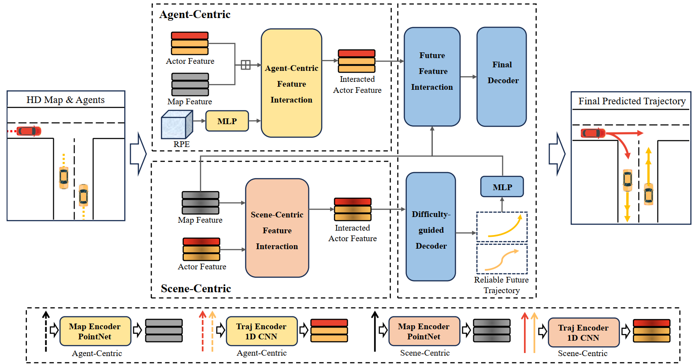
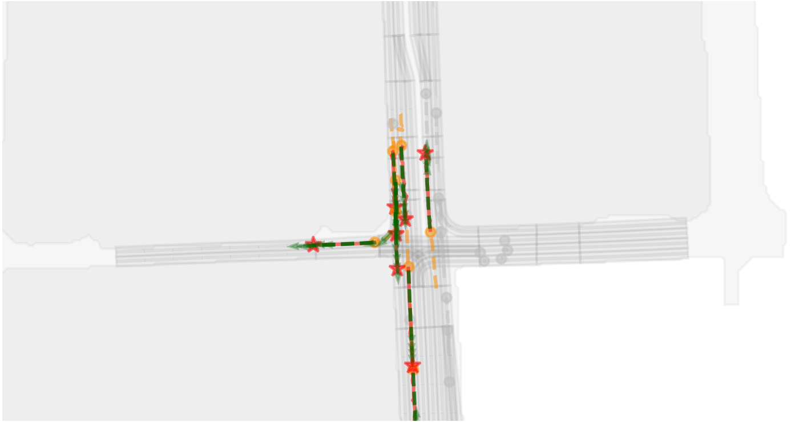
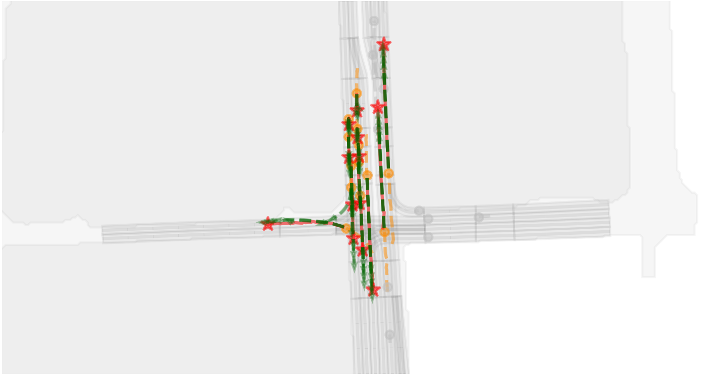
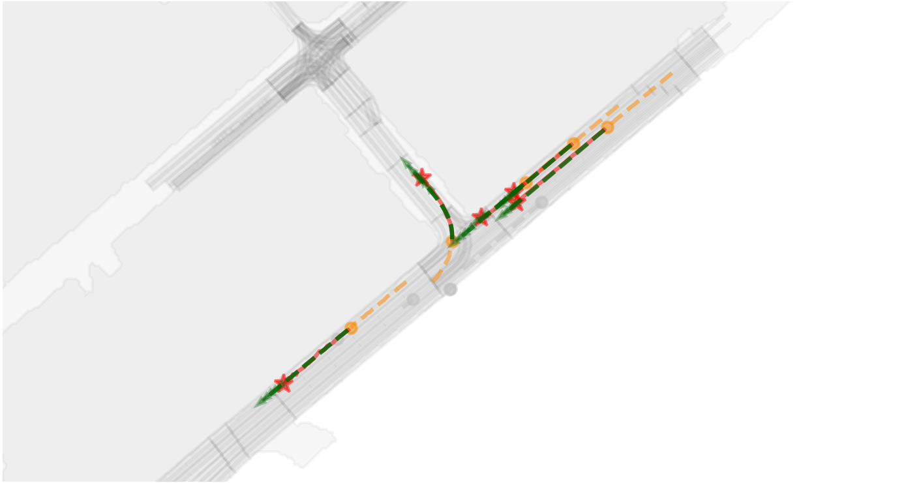
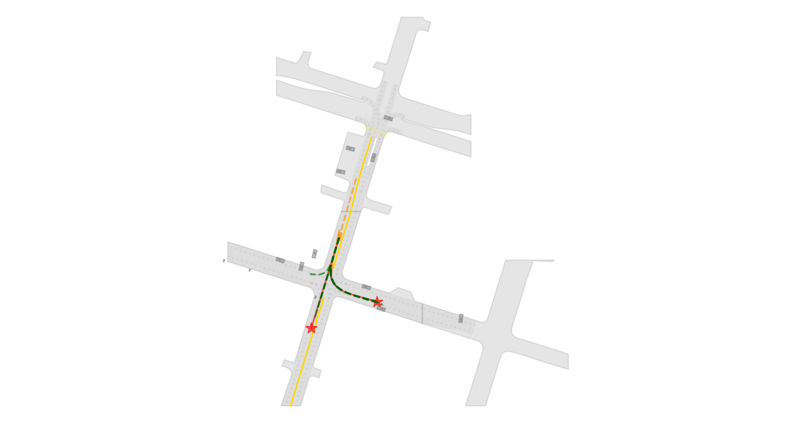
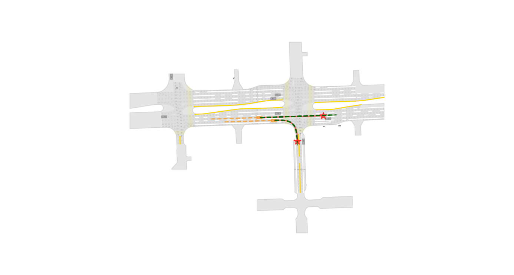
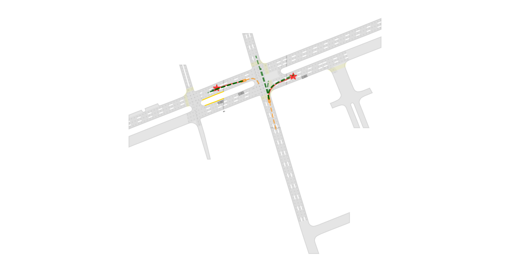

# DGFNet: Multi-Agent Trajectory Prediction with Difficulty-Guided Feature Enhancement Network
### [Paper](https://arxiv.org/abs/2407.18551) | [Webpage](https://github.com/XinGP/DGFNet)
This is the official implementation of the paper *Multi-Agent Trajectory Prediction with Difficulty-Guided Feature Enhancement Network*.

This paper is currently being submitted to IEEE Robotics and Automation Letters (RA-L).

## Introduction

<p align="center">
  
</p>

### Argoverse 1(single model)
- **Performance Metrics:**

| Split | brier-minFDE | minFDE | MR | minADE | Param |
|-------|:------------:|:------:|:--:|:------:|:------:|
| Val   | 1.499       | 0.897 | 0.073 | 0.634 | 4.53 |
| Test  | 1.742       | 1.117 | 0.108 | 0.763 | - |

### Argoverse 1(ensemble model)
- **Performance Metrics:**

| Split | brier-minFDE | minFDE | MR | minADE |
|-------|:------------:|:------:|:--:|:------:|
| Test  | 1.693       | 1.110 | 0.107 | 0.752 | 

## Qualitative Results

* On Argoverse 1 motion forecasting dataset
<p align="center">
  
  
  
</p>

* On Argoverse 2 motion forecasting dataset
<p align="center">
  
  
  
</p>

----


## Gettting Started

### Install dependencies
- Create a new conda virtual env
```
conda create --name DGFNet python=3.8
conda activate DGFNet
```

- Install PyTorch according to your CUDA version. We recommend CUDA >= 11.1, PyTorch >= 1.8.0.
```
conda install pytorch==1.12.0 torchvision==0.13.0 torchaudio==0.12.0 cudatoolkit=11.6 -c pytorch -c conda-forge
```

- Install Argoverse 1 APIs, please follow [argoverse-api](https://github.com/argoai/argoverse-api).

- Install other dependencies
```
pip install scikit-image IPython tqdm ipdb tensorboard
```

### Train from scratch

- Preprocess full Argoverse 1 motion forecasting dataset using the script:
```
sh scripts/argo_preproc.sh
```

- Launch training using the script:
```
sh scripts/DGFNet_train.sh
```

- For model evaluation, please refer to the following scripts:
```
sh scripts/DGFNet_eval.sh
```

### Test from scratch

- Generate files that can be submitted on the [EvalAI](https://eval.ai/web/challenges/challenge-page/454/submission):
```
sh scripts/DGFNet_test.sh
```

## How to Cite
```bibtex
@article{xin2024multi,
  title={Multi-Agent Trajectory Prediction with Difficulty-Guided Feature Enhancement Network},
  author={Xin, Guipeng and Chu, Duanfeng and Lu, Liping and Deng, Zejian and Lu, Yuang and Wu, Xigang},
  journal={arXiv preprint arXiv:2407.18551},
  year={2024}}
```

## Acknowledgment
We would like to express sincere thanks to the authors of the following packages and tools:
- [Simpl](https://github.com/HKUST-Aerial-Robotics/SIMPL)
- [ADAPT](https://github.com/gorkaydemir/ADAPT)
- [argoverse](https://github.com/argoverse)

## License
This repository is licensed under [MIT license](https://github.com/XinGP/DGFNet/blob/main/LICENSE).
