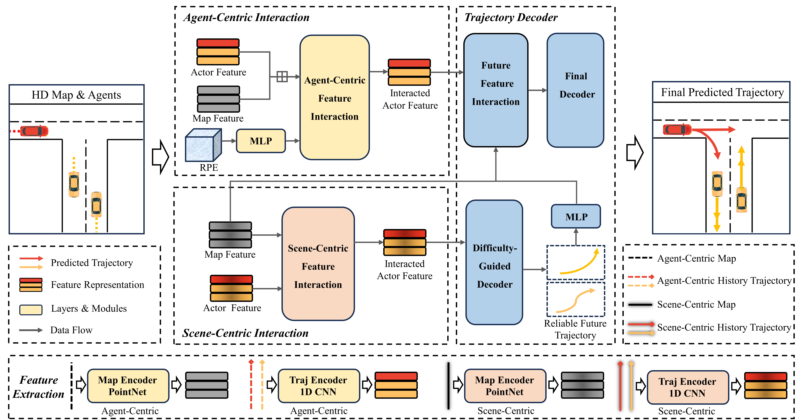

# DGFNet: Multi-Agent Trajectory Prediction with Difficulty-Guided Feature Enhancement Network
### [Paper](https://arxiv.org/abs/2407.18551) | [Webpage](https://github.com/XinGP/DGFNet)
This is the official implementation of the paper *Multi-Agent Trajectory Prediction with Difficulty-Guided Feature Enhancement Network*.

This paper is currently being submitted to IEEE Robotics and Automation Letters (RA-L).

## Introduction

Traditional methods usually perform holistic inference on the trajectories of agents, neglecting differences in prediction difficulty among agents. This paper proposes a novel Difficulty-Guided Feature Enhancement Network (**DGFNet**), which leverages the prediction difficulty differences among agents for multiagent trajectory prediction.

<p align="center">
  
</p>

Firstly, we employ Spatio-temporal Feature Extraction to capture rich spatio-temporal features. Secondly, a Difficulty-Guided Decoder controls the flow of future trajectories into subsequent modules, obtaining **reliable future trajectories**. Then, feature interaction and fusion are performed through the Future Feature Interaction module. Finally, the fused actor features are fed into the Final Decoder to generate the predicted trajectory distributions for multiple participants. Experimental results demonstrate that our model achieves SOTA performance on the Argoverse 1&2 motion forecasting benchmarks.

<p align="center">
  
</p>

### Argoverse 1(single model)
- **Performance Metrics:**

| Split | brier-minFDE | minFDE | MR | minADE | Param |
|-------|:------------:|:------:|:--:|:------:|:------:|
| Val   | 1.499       | 0.897 | 0.073 | 0.634 | 4.53 |
| Test  | 1.742       | 1.117 | 0.108 | 0.763 | - |

### Argoverse 1(ensemble model)
- **Performance Metrics:**

| Split | brier-minFDE | minFDE | MR | minADE |
|-------|:------------:|:------:|:--:|:------:|
| Test  | 1.693       | 1.110 | 0.107 | 0.752 | 

## Qualitative Results

* On Argoverse 1 motion forecasting dataset
<p align="center">
  
  
  
</p>

* On Argoverse 2 motion forecasting dataset
<p align="center">
  
  
  
</p>

----


## Gettting Started

### Install dependencies
- Create a new conda virtual env
```
conda create --name DGFNet python=3.8
conda activate DGFNet
```

- Install PyTorch according to your CUDA version. We recommend CUDA >= 11.1, PyTorch >= 1.8.0.
```
conda install pytorch==1.12.0 torchvision==0.13.0 torchaudio==0.12.0 cudatoolkit=11.6 -c pytorch -c conda-forge
```

- Install Argoverse 1 APIs, please follow [argoverse-api](https://github.com/argoai/argoverse-api).

- Install other dependencies
```
pip install scikit-image IPython tqdm ipdb tensorboard
```

### Train from scratch

- Preprocess full Argoverse 1 motion forecasting dataset using the script:
```
sh scripts/argo_preproc.sh
```

- Launch training using the script:
```
sh scripts/DGFNet_train.sh
```

- For model evaluation, please refer to the following scripts:
```
sh scripts/DGFNet_eval.sh
```

### Test from scratch

- Generate files that can be submitted on the [EvalAI](https://eval.ai/web/challenges/challenge-page/454/submission):
```
sh scripts/DGFNet_test.sh
```

## Contact
If you have any questions, please contact [Guipeng Xin](https://github.com/XinGP) via email (xinguipeng@whut.edu.cn).

## Citation
If you find DiffusionDrive is useful in your research or applications, please consider giving us a star 🌟 and citing it by the following BibTeX entry.
```bibtex
@article{xin2024multi,
  title={Multi-Agent Trajectory Prediction with Difficulty-Guided Feature Enhancement Network},
  author={Xin, Guipeng and Chu, Duanfeng and Lu, Liping and Deng, Zejian and Lu, Yuang and Wu, Xigang},
  journal={arXiv preprint arXiv:2407.18551},
  year={2024}}
```

## Acknowledgment
We would like to express sincere thanks to the authors of the following packages and tools:
- [Simpl](https://github.com/HKUST-Aerial-Robotics/SIMPL)
- [ADAPT](https://github.com/gorkaydemir/ADAPT)
- [argoverse](https://github.com/argoverse)

## License
This repository is licensed under [MIT license](https://github.com/XinGP/DGFNet/blob/main/LICENSE).
